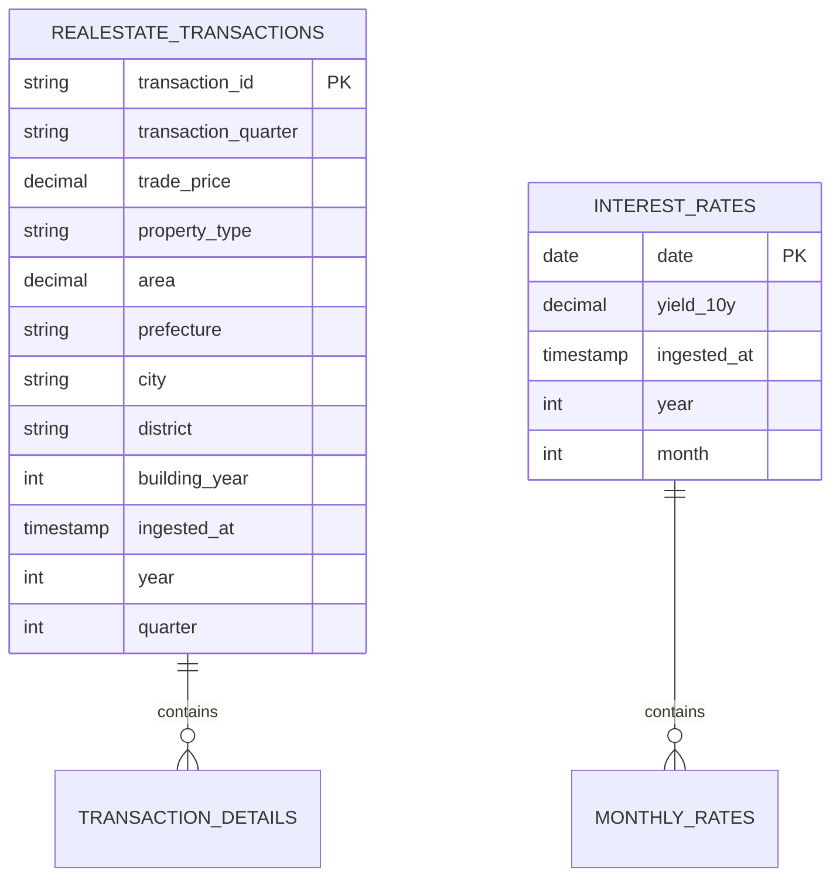
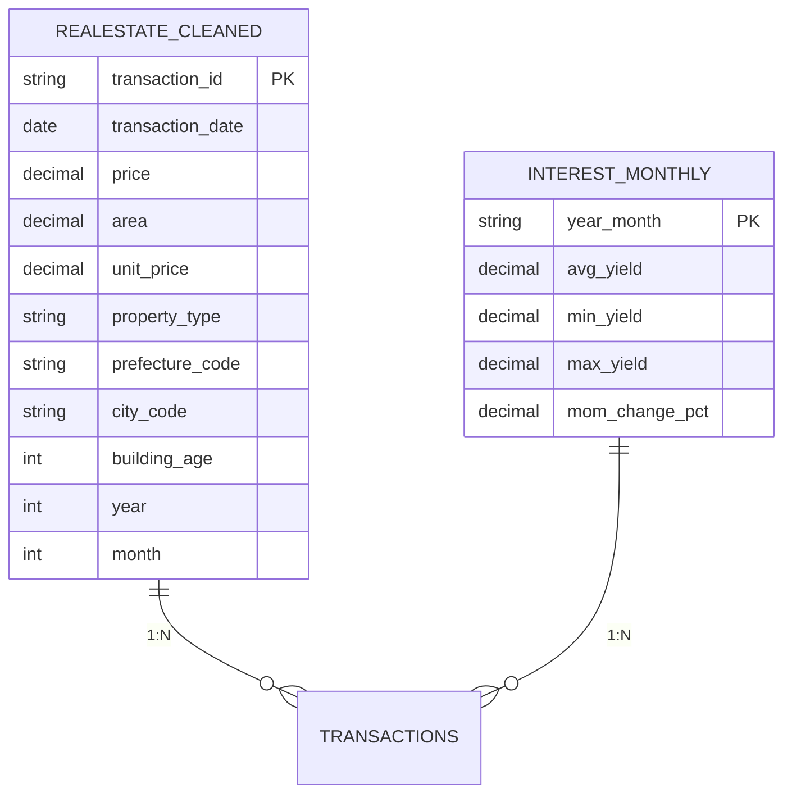
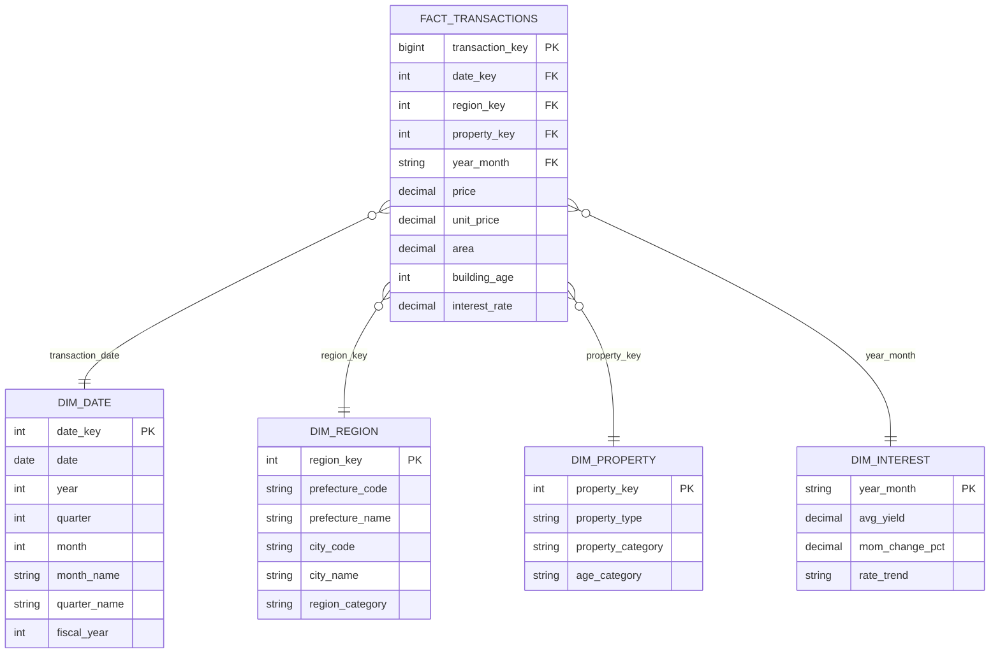
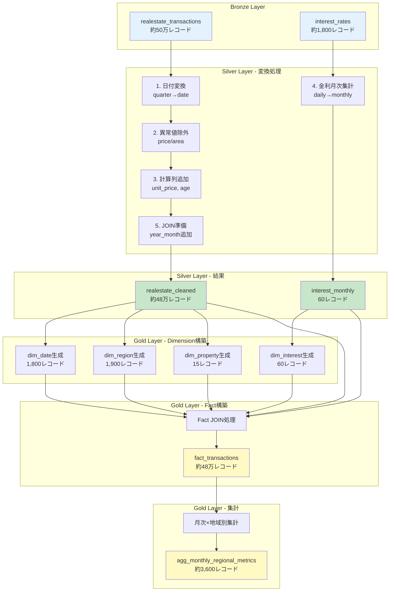

# データモデル設計書 - ERダイアグラムとスタースキーマ

## 🎯 分析対象の絞り込み

### 最優先分析課題（最もわかりやすく実装しやすい）

**RQ1: 金利変動がマンション価格に与える影響度は？**

選定理由：
1. ✅ データ取得が確実（国交省API + 日銀API）
2. ✅ 分析手法が明確（相関分析、回帰分析）
3. ✅ ビジュアライズが直感的（散布図、時系列）
4. ✅ ビジネス価値が明確（購入者への実用的示唆）
5. ✅ 技術的にシンプル（複雑な特徴量不要）

### この分析に必要なデータ要素

**必須データ：**
1. **不動産取引データ**
   - 取引価格
   - 取引時期（年月）
   - 面積
   - 物件種別（マンションのみ）
   - 地域（都道府県、市区町村）

2. **金利データ**
   - 10年国債利回り
   - 日付（月次集計）

3. **地域マスタ**
   - 都道府県コード
   - 都道府県名
   - 市区町村コード
   - 市区町村名

**任意データ（分析を豊かに）：**
- 築年数
- 最寄駅距離
- 面積帯

**不要なデータ（今回のRQ1には必要ない）：**
- ❌ CPI（実質価格計算は副次的）
- ❌ 土地形状や間口（マンションには関連薄）
- ❌ 詳細な構造情報

---

## 🏗 Bronze層（Raw Data）のER図



**Bronze層の特徴：**
- Raw Dataをそのまま保存
- 正規化は行わない
- パーティションキー（year, quarter/month）のみ追加

---

## 🔧 Silver層（Cleaned Data）のER図



**Silver層の変換内容：**
1. 取引時期を日付型に変換（2024年第1四半期 → 2024-01-01）
2. 単価計算（price / area）
3. 築年数計算（2024 - building_year）
4. 異常値除外（価格 0円〜10億円、面積 0〜1000㎡）
5. 金利の月次集計（日次 → 月次平均）

---

## ⭐ Gold層 - スタースキーマ設計

### スタースキーマ全体図



### 各テーブル詳細定義

#### 1. Fact Table: fact_transactions

**目的：** 各取引の詳細情報を保持（トランザクション粒度）

```sql
CREATE TABLE gold.fact_transactions (
    -- サロゲートキー
    transaction_key BIGINT PRIMARY KEY IDENTITY(1,1),

    -- 外部キー（Dimensionへの参照）
    date_key INT NOT NULL,
    region_key INT NOT NULL,
    property_key INT NOT NULL,
    year_month VARCHAR(7) NOT NULL,  -- 'YYYY-MM' 形式

    -- メジャー（分析対象の数値）
    price DECIMAL(15, 2) NOT NULL,
    unit_price DECIMAL(10, 2) NOT NULL,
    area DECIMAL(8, 2) NOT NULL,
    building_age INT,
    interest_rate DECIMAL(5, 3) NOT NULL,  -- この時点の金利

    -- メタデータ
    created_at DATETIME DEFAULT GETDATE(),

    -- 外部キー制約
    CONSTRAINT FK_fact_date FOREIGN KEY (date_key)
        REFERENCES dim_date(date_key),
    CONSTRAINT FK_fact_region FOREIGN KEY (region_key)
        REFERENCES dim_region(region_key),
    CONSTRAINT FK_fact_property FOREIGN KEY (property_key)
        REFERENCES dim_property(property_key),
    CONSTRAINT FK_fact_interest FOREIGN KEY (year_month)
        REFERENCES dim_interest(year_month)
);

-- パフォーマンス最適化
CREATE CLUSTERED COLUMNSTORE INDEX cci_fact_transactions
    ON gold.fact_transactions;

-- パーティション（年月でパーティション分割）
-- ※ Fabric Warehouseではパーティション構文が異なる場合あり
```

**Fact Tableの行数見込み：**
- 期間：2020Q1〜2024Q4（5年間）
- 取引件数：約50万件
- サイズ：約50MB（圧縮後）

#### 2. Dimension Table: dim_date（日付マスタ）

**目的：** 日付に関する属性を提供（年、四半期、月など）

```sql
CREATE TABLE gold.dim_date (
    date_key INT PRIMARY KEY,  -- YYYYMMDD形式（例：20240101）
    date DATE NOT NULL,
    year INT NOT NULL,
    quarter INT NOT NULL,  -- 1-4
    month INT NOT NULL,    -- 1-12
    month_name VARCHAR(20),  -- '2024年1月'
    quarter_name VARCHAR(20), -- '2024年Q1'
    fiscal_year INT,  -- 日本の年度（4月始まり）
    is_month_end BIT,  -- 月末フラグ

    CONSTRAINT UQ_date UNIQUE (date)
);

-- サンプルデータ
INSERT INTO gold.dim_date VALUES
(20240101, '2024-01-01', 2024, 1, 1, '2024年1月', '2024年Q1', 2023, 0),
(20240201, '2024-02-01', 2024, 1, 2, '2024年2月', '2024年Q1', 2023, 0);
-- ... 2020/1/1 〜 2024/12/31 まで約1,800レコード
```

#### 3. Dimension Table: dim_region（地域マスタ）

**目的：** 地域の階層構造を提供（都道府県 → 市区町村）

```sql
CREATE TABLE gold.dim_region (
    region_key INT PRIMARY KEY IDENTITY(1,1),
    prefecture_code VARCHAR(2) NOT NULL,  -- 総務省コード（例：'13' = 東京都）
    prefecture_name VARCHAR(50) NOT NULL,
    city_code VARCHAR(5),  -- 総務省コード（例：'13101' = 千代田区）
    city_name VARCHAR(100),
    region_category VARCHAR(20),  -- '都心', '郊外', '地方' など分類

    CONSTRAINT UQ_region UNIQUE (prefecture_code, city_code)
);

-- サンプルデータ
INSERT INTO gold.dim_region VALUES
(1, '13', '東京都', '13101', '千代田区', '都心'),
(2, '13', '東京都', '13102', '中央区', '都心'),
(3, '13', '東京都', '13201', '八王子市', '郊外');
-- ... 全国の市区町村 約1,900レコード
```

**地域分類の定義：**
```sql
region_category の分類ルール:
- '都心': 東京23区、大阪市内、名古屋市内など
- '郊外': 都心から30km圏内
- '地方': その他
```

#### 4. Dimension Table: dim_property（物件マスタ）

**目的：** 物件の種別・属性を提供

```sql
CREATE TABLE gold.dim_property (
    property_key INT PRIMARY KEY IDENTITY(1,1),
    property_type VARCHAR(50) NOT NULL,  -- 'マンション', '戸建', '土地'
    property_category VARCHAR(50),  -- '新築', '中古'（築年数から自動判定）
    age_category VARCHAR(20),  -- '新築', '築浅', '築古'

    CONSTRAINT UQ_property UNIQUE (property_type, property_category, age_category)
);

-- サンプルデータ
INSERT INTO gold.dim_property VALUES
(1, 'マンション', '新築', '新築'),        -- 築0-1年
(2, 'マンション', '中古', '築浅'),        -- 築2-10年
(3, 'マンション', '中古', '築古'),        -- 築11年以上
(4, '戸建', '新築', '新築'),
(5, '戸建', '中古', '築浅');
-- ... 約15レコード
```

**築年数カテゴリの定義：**
```sql
age_category の分類ルール:
- '新築': 築0-1年
- '築浅': 築2-10年
- '築古': 築11年以上
```

#### 5. Dimension Table: dim_interest（金利マスタ）

**目的：** 金利の時系列データと動向を提供

```sql
CREATE TABLE gold.dim_interest (
    year_month VARCHAR(7) PRIMARY KEY,  -- 'YYYY-MM' 形式
    avg_yield DECIMAL(5, 3) NOT NULL,   -- 平均利回り（%）
    min_yield DECIMAL(5, 3),
    max_yield DECIMAL(5, 3),
    mom_change_pct DECIMAL(6, 3),       -- 前月比変動率（%）
    rate_trend VARCHAR(20),             -- '上昇', '下降', '横ばい'

    CONSTRAINT CHK_yield CHECK (avg_yield >= 0 AND avg_yield <= 10)
);

-- サンプルデータ
INSERT INTO gold.dim_interest VALUES
('2024-01', 0.650, 0.620, 0.680, 5.2, '上昇'),
('2024-02', 0.720, 0.700, 0.750, 10.8, '上昇'),
('2024-03', 0.715, 0.690, 0.740, -0.7, '横ばい');
-- ... 2020/01 〜 2024/12 まで60レコード
```

**金利トレンド判定ロジック：**
```sql
rate_trend の判定:
- mom_change_pct > 2% → '上昇'
- mom_change_pct < -2% → '下降'
- -2% <= mom_change_pct <= 2% → '横ばい'
```

---

## 📊 集計テーブル（AGG層）

スタースキーマに加えて、頻繁に使う集計結果を事前計算して保存します。

### agg_monthly_regional_metrics（月次×地域別集計）

**目的：** ダッシュボードのパフォーマンス向上

```sql
CREATE TABLE gold.agg_monthly_regional_metrics (
    year_month VARCHAR(7),
    region_key INT,

    -- 集計メトリクス
    transaction_count INT,
    avg_price DECIMAL(15, 2),
    median_price DECIMAL(15, 2),
    std_price DECIMAL(15, 2),
    avg_unit_price DECIMAL(10, 2),
    min_price DECIMAL(15, 2),
    max_price DECIMAL(15, 2),

    -- 価格帯別件数
    count_low INT,   -- <3,000万円
    count_mid INT,   -- 3,000-6,000万円
    count_high INT,  -- >6,000万円

    -- 金利情報
    avg_interest_rate DECIMAL(5, 3),

    -- 前年同月比
    yoy_price_change_pct DECIMAL(6, 2),
    yoy_count_change_pct DECIMAL(6, 2),

    -- メタデータ
    calculated_at DATETIME DEFAULT GETDATE(),

    PRIMARY KEY (year_month, region_key),
    FOREIGN KEY (region_key) REFERENCES dim_region(region_key)
);

-- 計算クエリ例
INSERT INTO gold.agg_monthly_regional_metrics
SELECT
    year_month,
    region_key,
    COUNT(*) as transaction_count,
    AVG(price) as avg_price,
    PERCENTILE_CONT(0.5) WITHIN GROUP (ORDER BY price) as median_price,
    STDEV(price) as std_price,
    AVG(unit_price) as avg_unit_price,
    MIN(price) as min_price,
    MAX(price) as max_price,
    SUM(CASE WHEN price < 30000000 THEN 1 ELSE 0 END) as count_low,
    SUM(CASE WHEN price >= 30000000 AND price < 60000000 THEN 1 ELSE 0 END) as count_mid,
    SUM(CASE WHEN price >= 60000000 THEN 1 ELSE 0 END) as count_high,
    AVG(interest_rate) as avg_interest_rate,
    NULL as yoy_price_change_pct,  -- 別途計算
    NULL as yoy_count_change_pct,
    GETDATE() as calculated_at
FROM gold.fact_transactions
GROUP BY year_month, region_key;
```

---

## 🔄 データフロー（Bronze → Silver → Gold）

### 詳細な変換フロー



---

## ❓ 不足しているデータソースの確認

### 現在のデータで分析可能な内容

✅ **十分に分析可能：**
1. 金利と価格の相関分析
2. 時系列トレンド分析
3. 地域別比較
4. 価格帯別分析

### 分析を豊かにする追加データ候補（任意）

**優先度：中**
1. **住宅ローン金利データ**
   - 現状：10年国債利回り（市場金利）
   - 追加：実際の住宅ローン金利（変動・固定）
   - 効果：より実態に即した分析
   - 取得元：住宅金融支援機構API

2. **新築マンション供給指数**
   - 現状：取引データのみ
   - 追加：新築供給量
   - 効果：需給バランスの可視化
   - 取得元：不動産経済研究所データ

**優先度：低（今回は不要）**
3. CPI（消費者物価指数）
   - 理由：実質価格計算は副次的
   - 判断：省略可

4. 人口動態データ
   - 理由：分析が複雑化
   - 判断：今回は不要

### 最終判断

**現在の2つのデータソースで十分です：**
- ✅ 国交省 不動産取引価格API
- ✅ 日本銀行 10年国債利回り

**追加は不要。** シンプルで明確な分析に集中すべき。

---

## 📏 スタースキーマのサイズ見積もり

| テーブル | レコード数 | 1レコードサイズ | 合計サイズ（圧縮前） | 圧縮後 |
|---------|-----------|---------------|-------------------|--------|
| fact_transactions | 480,000 | 120 bytes | 57.6 MB | 約15 MB |
| dim_date | 1,800 | 80 bytes | 0.14 MB | 約0.05 MB |
| dim_region | 1,900 | 200 bytes | 0.38 MB | 約0.1 MB |
| dim_property | 15 | 150 bytes | 0.002 MB | <0.001 MB |
| dim_interest | 60 | 100 bytes | 0.006 MB | 約0.002 MB |
| agg_monthly_regional_metrics | 3,600 | 200 bytes | 0.72 MB | 約0.2 MB |
| **合計** | - | - | **58.9 MB** | **約15.4 MB** |

**Fabric Capacityへの影響：**
- 非常に軽量（<20MB）
- Direct Lakeで十分対応可能
- クエリパフォーマンス：高速（ミリ秒単位）

---

## 🎯 このスタースキーマで実現できる分析

### Power BIでのクエリ例

```dax
// DAXメジャー例

// 1. 平均価格（フィルタ適用可能）
Avg Price = AVERAGE(fact_transactions[price])

// 2. 金利との相関係数
Price-Interest Correlation =
CORRELATIONX(
    fact_transactions,
    fact_transactions[price],
    fact_transactions[interest_rate]
)

// 3. 前年同月比
YoY Growth =
VAR CurrentPrice = [Avg Price]
VAR PreviousYearPrice =
    CALCULATE(
        [Avg Price],
        DATEADD(dim_date[date], -1, YEAR)
    )
RETURN
    DIVIDE(CurrentPrice - PreviousYearPrice, PreviousYearPrice)

// 4. 金利帯別の平均価格
Avg Price by Rate Level =
SWITCH(
    TRUE(),
    AVERAGE(dim_interest[avg_yield]) < 0.5, "低金利",
    AVERAGE(dim_interest[avg_yield]) < 1.0, "中金利",
    "高金利"
)
```

### 分析シナリオ例

**シナリオ1: 金利上昇局面での価格変動**
```sql
-- SQLクエリ
SELECT
    r.prefecture_name,
    d.year_month,
    AVG(f.price) as avg_price,
    AVG(i.avg_yield) as interest_rate,
    COUNT(*) as transaction_count
FROM fact_transactions f
JOIN dim_date d ON f.date_key = d.date_key
JOIN dim_region r ON f.region_key = r.region_key
JOIN dim_interest i ON f.year_month = i.year_month
WHERE
    d.year >= 2023  -- 金利上昇期
    AND p.property_type = 'マンション'
GROUP BY r.prefecture_name, d.year_month
ORDER BY d.year_month, avg_price DESC;
```

**シナリオ2: 地域別の金利感応度**
```sql
-- 相関係数を地域別に計算
SELECT
    r.prefecture_name,
    CORR(f.price, i.avg_yield) as correlation_coefficient,
    COUNT(*) as sample_size
FROM fact_transactions f
JOIN dim_region r ON f.region_key = r.region_key
JOIN dim_interest i ON f.year_month = i.year_month
GROUP BY r.prefecture_name
HAVING COUNT(*) > 100  -- サンプルサイズ確保
ORDER BY correlation_coefficient DESC;
```

---

## ✅ まとめ

### このスタースキーマの特徴

1. **シンプルで理解しやすい**
   - Fact 1つ + Dimension 4つ
   - 初学者にも説明可能

2. **拡張性がある**
   - 新しいDimensionの追加が容易
   - 新しいメジャーの追加が容易

3. **パフォーマンスが高い**
   - 軽量（15MB）
   - Columnstore Indexで高速化
   - 集計テーブルで事前計算

4. **ビジネス要件を満たす**
   - RQ1（金利影響）を完全に分析可能
   - 地域別、時系列での多角的分析

### 外部発信時のアピールポイント

✅ 「スタースキーマによる正規化設計」
✅ 「Dimensionテーブルによる柔軟な分析軸」
✅ 「集計テーブルによるパフォーマンス最適化」
✅ 「外部キー制約によるデータ品質保証」

**このスタースキーマ設計は、Microsoftのエンジニアに対して「適切なデータモデリング能力」を示す好例です。**
