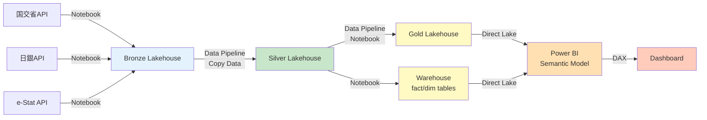

# Day 0（拡張版）- 分析プロジェクト設計 & 環境構築

## 🎯 Day 0の目的
**分析プロジェクトの設計を文書化し、技術選定の根拠を明確にする**

---

## 📋 分析プロジェクトの5フェーズ設計

### Phase 1: Problem（課題設定）

#### 1-1. 課題の明確化（30分）

**あなたが設定した課題の評価：**

| 課題 | 評価 | コメント |
|------|------|----------|
| ① 金利がマンション価格に与える影響はあるか | ✅ 優秀 | 因果関係の検証が実装可能 |
| ② 直近のマンション価格推移を確認し、狙い目な地域はあるか | ⚠️ 要明確化 | 「狙い目」の定義が必要 |
| ③ マンション価格帯ごとに売上げの特徴はあるか | ✅ 良好 | セグメント分析として有効 |
| ④ マンション属性で売上げの特徴はあるか | ✅ 良好 | 属性の定義が必要 |

#### 📝 課題設定の方向提案

**修正版：SMARTの原則に基づく課題設定**

```markdown
## 分析課題（Research Questions）

### 主要課題（Primary Question）
**RQ1: 金利変動がマンション価格に与える影響度は？**
- 測定指標：金利1%上昇時の価格変動率
- 対象期間：2020年Q1〜2024年Q4
- 対象地域：東京都、大阪府、愛知県（主要3都府県）

### 副次課題（Secondary Questions）

**RQ2: 金利上昇局面で、価格上昇が継続している地域は？**
- 定義：2023年以降の金利上昇期に前年比+5%以上
- 仮説：都心3区（千代田、中央、港）は影響を受けにくい

**RQ3: 価格帯別の売上げ特性は？**
- セグメント：
  - 低価格帯：3,000万円未満
  - 中価格帯：3,000万〜6,000万円
  - 高価格帯：6,000万円以上
- 仮説：高価格帯は金利感応度が低い（現金購入比率高）

**RQ4: 新築vs中古で金利影響度は異なるか？**
- 比較軸：価格変動率、取引量変動率
- 仮説：新築の方が金利影響を受けやすい（ローン依存度高）

**RQ5: マンション属性（築年数、面積、最寄駅距離）と売上げの関係**
- 分析手法：重回帰分析、決定木
- 仮説：駅近（徒歩5分以内）は売上げがブレにくい
```

#### 📌 成果物
- `docs/01_problem_definition.md`（課題定義書）
- SMARTの原則チェックリスト

---

### Phase 2: Plan（分析計画）

#### 2-1. 分析手法の選定（45分）

**各Research Questionに対する分析手法のマッピング**

```markdown
| RQ | 分析手法 | 使用技術 | 期待される可視化 |
|----|----------|----------|------------------|
| RQ1 | 相関分析、回帰分析 | pandas, statsmodels | 散布図、回帰直線 |
| RQ2 | トレンド分析、地域比較 | pandas, plotly | 地域別時系列ヒートマップ |
| RQ3 | セグメント分析、ANOVA | pandas, scipy | 箱ひげ図、バイオリンプロット |
| RQ4 | 比較分析、t検定 | pandas, scipy | 並行時系列、差分プロット |
| RQ5 | 重回帰分析、決定木 | scikit-learn, shap | 特徴量重要度、部分依存プロット |
```

#### 2-2. 技術スタック選定（技術選定根拠を明文化）

##### 🔍 **データ取得方法の選定**

**質問への回答：なぜAPI経由か？**

| 選択肢 | メリット | デメリット | 採用判断 |
|--------|----------|------------|----------|
| **手動CSV** | 簡単、確実 | 更新時に手動作業、自動化不可 | ❌ 却下 |
| **API経由** | 自動化可能、最新データ取得、再現性高 | 実装コスト、API制限 | ✅ **採用** |
| **Webスクレイピング** | 柔軟性高 | 不安定、利用規約違反リスク | ❌ 却下 |

**採用理由の詳細：**
1. **国土交通省 不動産取引価格API**
   - 公式API提供あり（https://www.land.mlit.go.jp/webland/api.html）
   - 推奨される取得方法（利用規約で明記）
   - 四半期ごとの自動更新に対応可能
   - Fabricパイプラインでの自動実行が可能

2. **日本銀行 時系列統計API**
   - 公式API提供あり
   - JSON/CSV形式で取得可能
   - レート制限：緩い（1日1000リクエスト）

3. **e-Stat API（CPI）**
   - 政府統計の総合窓口が提供
   - APIキー登録必要（無料）
   - 統計表IDで直接取得可能

**Fabricでの実装方法：**
```python
# Fabric Notebook内で実行
# または Data Pipeline の「Notebook アクティビティ」で実行
import requests
import pandas as pd

def fetch_realestate_api():
    url = "https://www.land.mlit.go.jp/webland/api/TradeListSearch"
    # APIコール実装
    # Fabricの環境変数から認証情報取得
    return df
```

##### 🏗 **Fabricコンポーネント選定マトリクス**

**質問への回答：どの技術スタックを使うか？**

| 処理層 | 実装方法 | 選定理由 | 代替案 |
|--------|----------|----------|--------|
| **データ取得** | Notebook | Pythonでの柔軟な処理が必要 | Data Pipeline（REST APIコネクタ）でも可 |
| **Bronze書き込み** | Notebook → Lakehouse | Delta Lake直接書き込みが必要 | - |
| **Bronze→Silver** | **Data Pipeline** | GUI開発、スケジューリング標準機能 | Notebook（より柔軟だが管理複雑） |
| **Silver→Gold** | **Data Pipeline** | 安定的な集計処理に最適 | - |
| **複雑な分析** | Notebook | 機械学習や統計分析が必要 | - |
| **可視化前処理** | **Dataflow Gen2** | Power Query M式、GUIベース | Notebook |

**詳細な技術選定：**

```markdown
### Bronze層への取り込み
**選定：Fabric Notebook**

理由：
1. APIレスポンスの柔軟な処理が必要
2. エラーハンドリングの詳細な制御
3. データバリデーションロジックの実装
4. Delta Lake への直接書き込みが可能

実装イメージ：
├── Notebook: `nb_ingest_realestate_bronze.ipynb`
│   ├── APIコール（requests）
│   ├── データバリデーション
│   ├── Delta Lake書き込み（spark.write.format("delta")）
│   └── ログ出力
└── スケジュール（Data Pipeline で呼び出し）

---

### Silver層への取り込み（Bronze→Silver変換）
**選定：Data Pipeline（Copy Dataアクティビティ + Notebook）**

理由：
1. 安定的な変換処理が中心
2. スケジューリング、監視機能が標準
3. 増分ロードの実装が容易（Query folding）
4. ビジュアルデザイナーでメンテナンス性向上

実装イメージ：
Data Pipeline: `pl_bronze_to_silver`
├── パラメータ：processing_date
├── アクティビティ1：Notebook（データ品質チェック）
├── アクティビティ2：Copy Data
│   ├── Source：Bronze Lakehouse（Delta）
│   ├── Transformation：
│   │   ├── 異常値除外（WHERE price > 0 AND price < 1000000000）
│   │   ├── 計算列追加（unit_price = price / area）
│   │   └── 型変換
│   └── Sink：Silver Lakehouse（Delta、partition by year, quarter）
└── アクティビティ3：Notebook（ウォーターマーク更新）

代替案：Dataflow Gen2
- メリット：Power Query M式でGUI開発可能
- デメリット：Python/Spark比較で柔軟性低
- 判断：シンプルな変換ならDataflow、複雑ならPipeline+Notebook

---

### Gold層への取り込み（Silver→Gold集計）
**選定：Data Pipeline（Notebook + Warehouse SQL）**

理由：
1. 集計ロジックが複雑（時系列集計、地域別集計、統計計算）
2. Warehouse のスタースキーマに整形
3. セマンティックモデルとの連携

実装イメージ：
Data Pipeline: `pl_silver_to_gold`
├── Notebook：`nb_calculate_metrics.ipynb`
│   ├── Silver読み込み（Spark DataFrame）
│   ├── 集計処理
│   │   ├── 月次集計（groupBy, agg）
│   │   ├── 移動平均計算（window関数）
│   │   └── 前年比計算
│   └── Gold Lakehouseへ書き込み
├── Stored Procedure アクティビティ
│   └── Warehouse で実行：
│       ├── Dimension table更新（SCD Type 1）
│       └── Fact table INSERT
└── スクリプトアクティビティ
    └── セマンティックモデルリフレッシュ

---

### 可視化層（Power BI）
**選定：Direct Lake + DAX + Power Query（必要時）**

使い分け：
1. **Direct Lake**（主要）
   - 用途：Gold レイヤーの fact/dim テーブル直接参照
   - メリット：リアルタイム性、大容量対応
   - 制約：一部DAX関数制限あり

2. **DAX メジャー**
   - 用途：動的な計算（YoY, 構成比, ランキング）
   - 例：
     ```dax
     YoY Growth % =
     VAR CurrentPrice = SUM(fact_transactions[price])
     VAR PreviousPrice = CALCULATE(
         SUM(fact_transactions[price]),
         DATEADD(dim_date[Date], -1, YEAR)
     )
     RETURN DIVIDE(CurrentPrice - PreviousPrice, PreviousPrice)
     ```

3. **Power Query M式**（Dataflow Gen2から取り込み時）
   - 用途：Power BI独自の前処理（例：カスタムカラム）
   - 本プロジェクトでは最小限に（ロジックはPipeline側に集約）
```

#### 📊 データフロー全体図（Mermaid）



#### 2-3. 必要なデータ項目の定義（30分）

**データ要件定義書**

```markdown
## Bronze層 データ項目

### realestate_transactions（不動産取引）
| 項目名 | 型 | 必須 | 説明 | ソース |
|--------|-----|------|------|--------|
| transaction_id | string | ✅ | 取引ID（生成） | - |
| transaction_quarter | string | ✅ | 取引時期（例：2024年第1四半期） | API |
| trade_price | decimal | ✅ | 取引価格（円） | API |
| floor_plan | string | - | 間取り | API |
| area | decimal | ✅ | 面積（㎡） | API |
| unit_price | decimal | - | 単価（計算） | 計算 |
| land_shape | string | - | 土地の形状 | API |
| frontage | decimal | - | 間口（m） | API |
| building_year | string | - | 建築年 | API |
| structure | string | - | 構造（RC、木造等） | API |
| use | string | ✅ | 用途（住宅、店舗等） | API |
| city_planning | string | - | 都市計画 | API |
| renovation | string | - | 改装有無 | API |
| transaction_type | string | ✅ | 取引の事情 | API |
| prefecture | string | ✅ | 都道府県 | API |
| city | string | ✅ | 市区町村 | API |
| district | string | - | 地区 | API |
| nearest_station | string | - | 最寄駅 | API |
| distance_station | decimal | - | 駅距離（分） | API |
| ingested_at | timestamp | ✅ | 取り込み日時 | システム |
| year | int | ✅ | パーティションキー | 計算 |
| quarter | int | ✅ | パーティションキー | 計算 |

### interest_rates（金利）
| 項目名 | 型 | 必須 | 説明 |
|--------|-----|------|------|
| date | date | ✅ | 日付 |
| yield_10y | decimal | ✅ | 10年国債利回り（%） |
| ingested_at | timestamp | ✅ | 取り込み日時 |
| year | int | ✅ | パーティションキー |
| month | int | ✅ | パーティションキー |

### cpi（消費者物価指数）
| 項目名 | 型 | 必須 | 説明 |
|--------|-----|------|------|
| year_month | string | ✅ | 年月（YYYY-MM） |
| cpi_value | decimal | ✅ | CPI値（2020年=100） |
| ingested_at | timestamp | ✅ | 取り込み日時 |
```

#### 2-4. データ加工ロジックの詳細設計（1時間）

**Silver層 変換ロジック定義**

```python
# 擬似コード形式で変換ロジックを定義

## Silver: realestate_cleaned
def transform_to_silver(bronze_df):
    """
    Bronze → Silver 変換ロジック
    """
    # 1. 日付変換
    df['transaction_date'] = convert_quarter_to_date(df['transaction_quarter'])
    # 例：「2024年第1四半期」→ 2024-01-01

    # 2. 異常値除外
    df = df[
        (df['trade_price'] > 0) & (df['trade_price'] < 1_000_000_000) &  # 0円〜10億円
        (df['area'] > 0) & (df['area'] < 1000)  # 0㎡〜1000㎡
    ]

    # 3. 計算列追加
    df['unit_price'] = df['trade_price'] / df['area']  # 単価
    df['building_age'] = 2024 - df['building_year']  # 築年数

    # 4. カテゴリ正規化
    df['property_type'] = normalize_property_type(df['use'])
    # マンション等 → マンション、居住用住宅 → マンション、戸建 → 戸建

    # 5. 地域コード標準化
    df['region_code'] = standardize_region_code(df['prefecture'], df['city'])

    # 6. NULL処理
    df['nearest_station'].fillna('不明', inplace=True)
    df['distance_station'].fillna(-1, inplace=True)  # -1 = 不明

    return df

## Silver: interest_rates_monthly
def aggregate_interest_monthly(bronze_df):
    """
    日次金利 → 月次集計
    """
    df_monthly = bronze_df.groupby(['year', 'month']).agg({
        'yield_10y': ['mean', 'min', 'max', 'std']
    }).reset_index()

    df_monthly.columns = ['year', 'month', 'avg_yield', 'min_yield', 'max_yield', 'std_yield']

    # 前月比計算
    df_monthly['yield_mom_change'] = df_monthly['avg_yield'].pct_change()

    return df_monthly
```

**Gold層 集計ロジック定義**

```sql
-- Gold: agg_monthly_regional_metrics
-- 月次×地域別の集計メトリクス

WITH base AS (
    SELECT
        DATE_TRUNC('month', transaction_date) as year_month,
        region_code,
        property_type,
        trade_price,
        unit_price,
        area
    FROM silver.realestate_cleaned
    WHERE property_type = 'マンション'  -- マンションのみ
)
SELECT
    year_month,
    region_code,
    COUNT(*) as transaction_count,
    AVG(trade_price) as avg_price,
    PERCENTILE_CONT(0.5) WITHIN GROUP (ORDER BY trade_price) as median_price,
    STDDEV(trade_price) as std_price,
    AVG(unit_price) as avg_unit_price,
    MIN(trade_price) as min_price,
    MAX(trade_price) as max_price,
    -- 価格帯別件数
    SUM(CASE WHEN trade_price < 30000000 THEN 1 ELSE 0 END) as count_low,
    SUM(CASE WHEN trade_price BETWEEN 30000000 AND 60000000 THEN 1 ELSE 0 END) as count_mid,
    SUM(CASE WHEN trade_price > 60000000 THEN 1 ELSE 0 END) as count_high
FROM base
GROUP BY year_month, region_code;

-- Gold: fact_transactions（スタースキーマのFact）
CREATE TABLE gold.fact_transactions AS
SELECT
    t.transaction_id,
    d.date_key,
    r.region_key,
    p.property_key,
    t.trade_price,
    t.unit_price,
    t.area,
    i.avg_yield as interest_rate,
    c.cpi_value,
    -- 実質価格計算
    t.trade_price / (c.cpi_value / 100) as real_price
FROM silver.realestate_cleaned t
LEFT JOIN gold.dim_date d ON t.transaction_date = d.date
LEFT JOIN gold.dim_region r ON t.region_code = r.region_code
LEFT JOIN gold.dim_property p ON t.property_type = p.property_type
LEFT JOIN silver.interest_rates_monthly i ON DATE_TRUNC('month', t.transaction_date) = i.year_month
LEFT JOIN silver.cpi c ON DATE_TRUNC('month', t.transaction_date) = c.year_month;
```

#### 📌 成果物
- `docs/02_analysis_plan.md`（分析計画書）
- `docs/03_technical_architecture.md`（技術アーキテクチャ設計書）
- `docs/04_data_dictionary.md`（データディクショナリ）
- `docs/05_transformation_logic.md`（変換ロジック定義書）

---

### Phase 3: Data（データ収集）

**※ これは Day 1以降で実装するが、Day 0では計画のみ**

#### 3-1. データ収集計画（30分）

**データ取得スケジュール**

```markdown
## 取得データ一覧

| データソース | 取得期間 | 件数見込み | 取得頻度 | 取得方法 |
|-------------|----------|-----------|----------|----------|
| 国交省 不動産API | 2020Q1〜2024Q4 | 約50万件 | 四半期1回 | REST API |
| 日銀 金利 | 2020/01〜2024/12 | 約1,800件 | 日次（初回は全件、以降差分） | REST API/CSV |
| e-Stat CPI | 2020/01〜2024/12 | 60件 | 月次 | REST API |

## データ取得リスクと対策

| リスク | 発生確率 | 影響度 | 対策 |
|--------|----------|--------|------|
| APIレート制限 | 中 | 中 | リトライロジック、スリープ実装 |
| データ欠損 | 低 | 高 | 欠損時は取得データで補完 |
| API仕様変更 | 低 | 高 | バージョン管理、テスト自動化 |
```

#### 📌 成果物
- `docs/06_data_collection_plan.md`

---

### Phase 4 & 5: Analysis & Conclusion

**※ Day 4〜7で実施。Day 0では分析設計のみ**

#### 4-1. 分析シナリオ設計（45分）

**分析ストーリーボード**

```markdown
## 分析の流れ（ダッシュボードページ構成）

### Page 1: Executive Summary（エグゼクティブサマリー）
目的：全体像を1ページで提示

KPIカード：
- 平均取引価格（全期間）
- 総取引件数
- 平均金利
- 価格上昇率（直近1年）

主要グラフ：
- 価格トレンド（月次、金利オーバーレイ）
- 地域別ヒートマップ（価格上昇率）

### Page 2: Interest Rate Impact（金利影響分析）← RQ1対応
目的：金利が価格に与える影響を定量化

グラフ：
- 散布図（金利 vs 価格、相関係数表示）
- 回帰分析結果（係数、p値、R²）
- 金利別の価格推移（金利帯で色分け）

インサイト例：
「金利1%上昇で平均価格は-3.2%低下（p<0.05）」

### Page 3: Regional Deep Dive（地域別分析）← RQ2対応
目的：金利上昇期でも伸びている地域を特定

グラフ：
- 地図ビジュアル（都道府県/市区町村）
- 地域別価格推移（トップ10/ボトム10）
- バブルチャート（取引量 vs 価格成長率）

フィルター：
- 期間スライサー
- 地域階層（都道府県→市区町村→地区）

### Page 4: Price Segment Analysis（価格帯分析）← RQ3対応
目的：価格帯ごとの特性を明らかに

グラフ：
- 箱ひげ図（価格帯別の分布）
- 価格帯別成長率比較
- 構成比推移（積み上げ面グラフ）

セグメント：
- 低価格帯：<3,000万
- 中価格帯：3,000〜6,000万
- 高価格帯：>6,000万

### Page 5: Property Attributes（属性分析）← RQ4, RQ5対応
目的：新築vs中古、その他属性の影響を分析

グラフ：
- 新築vs中古 価格推移比較
- 特徴量重要度（機械学習結果）
- 部分依存プロット（築年数、駅距離）

### Page 6: Predictive Insights（予測・将来展望）
目的：今後の見通しを提供

グラフ：
- 価格予測（3ヶ月先、信頼区間付き）
- シナリオ分析（金利+1%, +2%, +3%）
- 異常検知アラート
```

#### 📌 成果物
- `docs/07_analysis_storyboard.md`
- PowerPointラフスケッチ（手書きもOK）

---

## 🛠️ Day 0 実施タスクリスト

### 午前セッション（4時間）：分析設計

- [ ] **Problem定義**（30分）
  - [ ] Research Questions明文化
  - [ ] SMARTの原則チェック
  - [ ] `docs/01_problem_definition.md` 作成

- [ ] **Plan - 分析手法選定**（45分）
  - [ ] RQごとの分析手法マッピング
  - [ ] `docs/02_analysis_plan.md` 作成

- [ ] **Plan - 技術スタック選定**（1時間30分）
  - [ ] データ取得方法の検討・明文化
  - [ ] Fabricコンポーネント選定（Notebook vs Pipeline vs Dataflow）
  - [ ] データフロー図作成（Mermaid）
  - [ ] `docs/03_technical_architecture.md` 作成

- [ ] **昼休憩**（1時間）

### 午後セッション（4時間）：詳細設計 & 環境構築

- [ ] **Data - データ要件定義**（30分）
  - [ ] Bronze/Silver/Gold各層のスキーマ定義
  - [ ] `docs/04_data_dictionary.md` 作成

- [ ] **Data - 変換ロジック設計**（1時間）
  - [ ] Silver変換ロジック擬似コード
  - [ ] Gold集計SQL
  - [ ] `docs/05_transformation_logic.md` 作成

- [ ] **Analysis設計**（45分）
  - [ ] ダッシュボードストーリーボード作成
  - [ ] `docs/07_analysis_storyboard.md` 作成

- [ ] **環境構築**（1時間45分）
  - [ ] Microsoft Fabricワークスペース作成
  - [ ] Git連携設定（GitHub/Azure DevOps）
  - [ ] Lakehouse作成（bronze/silver/gold）
  - [ ] Warehouse作成
  - [ ] フォルダ構造セットアップ

---

## 📁 Day 0終了時点のプロジェクト構造

```
fabric-realestate-analytics/
├── docs/
│   ├── 01_problem_definition.md          ← 課題定義
│   ├── 02_analysis_plan.md               ← 分析計画
│   ├── 03_technical_architecture.md      ← 技術設計
│   ├── 04_data_dictionary.md             ← データ定義
│   ├── 05_transformation_logic.md        ← 変換ロジック
│   ├── 06_data_collection_plan.md        ← データ収集計画
│   └── 07_analysis_storyboard.md         ← 分析ストーリー
├── data_ingestion/                        （準備のみ、実装はDay1）
│   ├── config.py
│   └── README.md
├── notebooks/                             （準備のみ）
│   └── README.md
├── pipelines/                             （準備のみ）
│   └── README.md
├── warehouse/                             （準備のみ）
│   └── README.md
├── powerbi/                               （準備のみ）
│   └── README.md
└── README.md                              ← プロジェクト概要
```

---

## 🤖 Claude Code活用（Day 0向け）

### ドキュメント生成の自動化

```bash
# 例1: 課題定義書のテンプレート生成
claude code "
分析プロジェクトの課題定義書テンプレートをMarkdownで作成。

構成:
1. プロジェクト背景
2. Research Questions（SMARTの原則に基づく）
3. 成功指標
4. 制約事項

Research Questionsセクションには、主要課題1つ、副次課題4つの枠を用意。
"

# 例2: データディクショナリ生成
claude code "
以下のスキーマ情報から、データディクショナリ（Markdown表形式）を生成:

[スキーマ情報を貼り付け]

各カラムに対して:
- 項目名
- データ型
- 必須/任意
- 説明
- サンプル値
を含める
"

# 例3: Mermaid図生成
claude code "
以下のデータフローをMermaid記法で可視化:

1. 国交省API → Bronze Lakehouse（Notebook）
2. Bronze → Silver（Data Pipeline）
3. Silver → Gold（Data Pipeline + Notebook）
4. Gold → Warehouse（SQL）
5. Warehouse → Power BI（Direct Lake）

色分け:
- Bronze: 青
- Silver: 緑
- Gold: 黄
- BI: オレンジ
"
```

---

## ✅ Day 0 完了チェックリスト

### 設計ドキュメント
- [ ] 課題定義書が完成し、Research Questionsが明確
- [ ] 各RQに対する分析手法がマッピングされている
- [ ] 技術スタック選定の根拠が明文化されている
- [ ] データフロー図（Mermaid）が完成
- [ ] Bronze/Silver/Goldのスキーマが定義されている
- [ ] 変換ロジックが擬似コード/SQLで記述されている
- [ ] ダッシュボードのストーリーボードが完成

### 環境構築
- [ ] Fabricワークスペースが作成されている
- [ ] Git連携が設定されている
- [ ] Lakehouse（bronze/silver/gold）が作成されている
- [ ] Warehouseが作成されている
- [ ] プロジェクトフォルダ構造がセットアップされている

### レビュー観点
- [ ] 外部発信を想定した記述になっているか
- [ ] 技術選定の根拠が明確か
- [ ] 再現可能な設計になっているか

---

## 🎁 Day 0の成果物が外部発信に与える価値

設計フェーズを丁寧に行うことで、以下の価値を提供できます：

1. **技術ブログでの差別化**
   - 「単に作った」ではなく、「なぜそう設計したか」を説明可能
   - Architecture Decision Record（ADR）として説得力が増す

2. **エンジニア採用でのアピール**
   - 設計力、ドキュメント作成能力を示せる
   - 「見える化」プロセスは評価が高い

3. **再現性の担保**
   - 他者が追試可能な設計
   - オープンソースプロジェクトとしての質

4. **ポートフォリオとしての完成度**
   - コードだけでなく、思考やプロセスを見せられる
   - Microsoftのエンジニアが重視する「ドキュメント文化」に合致

---

**Day 0の設計を丁寧に行うことで、Day 1以降の実装がスムーズになり、外部発信時の説得力が大幅に向上します。**

準備ができたら、Day 1の実装に進みましょう！
